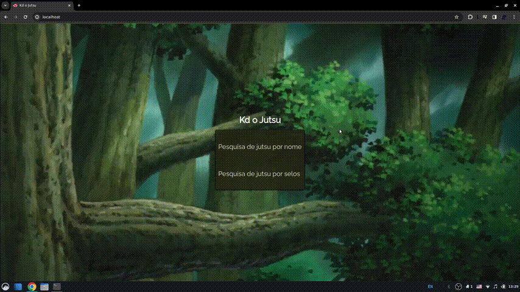

# Kd o Jutsu

## Sobre o projeto

Kd o jutsu é um web site que permite a pesquisa de jutsus por nome
ou por selos contidos em sua realização. A obtenção dos dados é explicada
pelo arquivo: [database](src/database/explain/README.md). A manipulação
dos arquivos CSV foi feita utilizando a biblioteca 
[pandas](https://www.w3schools.com/python/pandas/default.asp).

## Pontos de melhoria

### Alterar o CSV de [jutsu.csv](src/database/jutsu.csv)

#### Adicionando a coluna *seal_sequence*

Que é definida pela função 
[append_seal_sequence](https://github.com/JoaoHenrique12/kd_o_jutsu/blob/main/src/utils.py#L45C5-L45C25).
A não existência desta coluna exige a computação deste dado
em todo carregamento de listagem de jutsus, o que aumenta o tempo de espera 
do usuário.

#### Remover a coluna *image*

O propósito inicial era expor estas imagens na listagem dos jutsus. Porém o 
[CDN](https://www.cloudflare.com/pt-br/learning/cdn/what-is-a-cdn/)
que armazena as imagens bloqueia requisições que não são feitas pelo site da 
[Naruto Fandom](https://naruto.fandom.com/pt-br/wiki/Categoria:Ninjutsu).